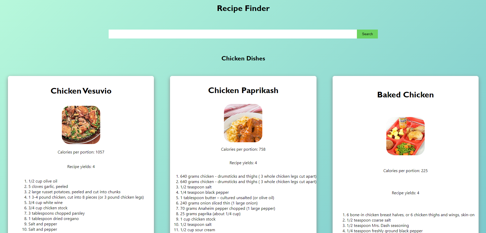

# Recipe Search App

## Description

This application uses React to create a component based application that allows users to search by ingredient to find recieps with ingredient lists, instructions and images of the end meal. 

## Screenshots

## Live Project
The live version of this project can be found here: https://guarded-badlands-10806.herokuapp.com/

## Licensing 
The licensing used for this project is MIT

## Contributions 
Author: Rachael McIlhagga
Twitter: @breadlikerach
    
## Questions
* If you have any questions about this project, please reach out to me  through <a href="https://github.com/mcilhaggis">Github</a>  or via <a href="mailto:rachael.mcilhagga@live.co.uk">Email</a>
